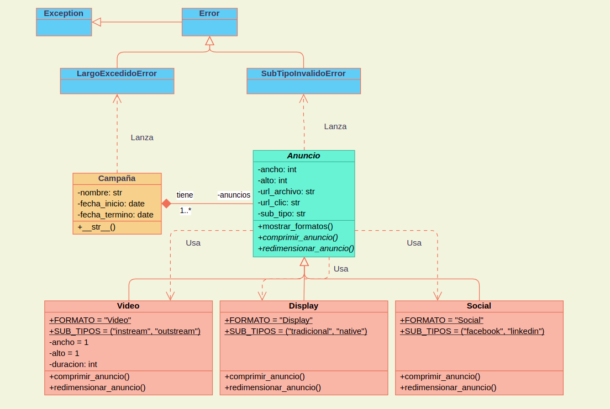

# Programacion avanzada en python / Empresa de marketing 

Es una empresa de marketing digital que se dedica a implementar campañas publicitarias en distintas plataformas de anuncios digitales. Para ello, tienen una plataforma web para sus clientes, donde ellos ingresan los datos necesarios para la campaña que desean que sea implementada. Actualmente, esta plataforma funciona como una aplicación web MVC, construida en lenguaje PHP. 

Actualmente el  equipo de desarrollo se predispone a construir una API que implemente la lógica “BackEnd” de su plataforma actual, de forma que ésta pueda ser consumida tanto por un FrontEnd Web de escritorio, como por su aplicación móvil, así como también por los clientes que quieran hacer uso de ella en sus propias aplicaciones. Este
desarrollo se realizará de forma incremental, con entregas parciales cada dos semanas.

como primer paso se realiza el diagrama de clases para poder desarrollar el programa:



## anuncio.py 

Este archivo contiene las siguientes clases para su correcto funcionamiento:

### clase Anuncio:

Esta clase representa un anuncio publicitario con propiedades básicas como tamaño, URL del archivo y URL de clic. Además, gestiona el subtipo del anuncio y permite mostrar formatos y subtipos permitidos. La clase también incluye validación para el subtipo del anuncio, asegurando que solo se acepten subtipos válidos.

### clase Video 

es una extensión de la clase Anuncio diseñada para manejar anuncios en formato de video. Soporta dos sub-tipos: "instream" y "outstream". Permite definir propiedades como la duración del video y proporciona métodos para compresión y redimensionamiento (aún no implementados).

### clase Display

Es una subclase de "Anuncio" que representa anuncios en formato de display. Está diseñada para manejar anuncios en dos sub-tipos: "tradicional" y "native". Incluye métodos para compresión y redimensionamiento, que aún no están implementados.

### clase Social

es una subclase de "Anuncio" que representa anuncios en plataformas de redes sociales. Maneja dos sub-tipos de anuncios: "facebook" y "linkedin".

## campaña.py

Contiene la clase Campaña que gestiona una campaña publicitaria que contiene anuncios de diferentes formatos. Valida los parámetros de entrada, crea instancias de anuncios basadas en los datos proporcionados y ofrece una representación en cadena de la campaña.

## demo.py 

Este script es el punto de entrada para gestionar campañas publicitarias usando la clase Campaña. Permite crear una campaña, actualizar el nombre de la campaña y el tipo de anuncio, y maneja errores mediante excepciones.

## error.py

En este archivo se definen excepciones personalizadas utilizadas en el manejo de errores dentro del proyecto. Estas excepciones son utilizadas para gestionar errores específicos relacionados con la validación de datos en las campañas y anuncios.

## error.log 

Se Utiliza para almacenar los errores al momento de inicializar el programa por el usuario. 

## Prerrequisitos o Dependencias

Sistema Operativo Windows, Linux, MacOS
Lenguaje de programación Python 3.12

## Instalación del Proyecto

Clonar el repositorio:

```bash
# https://github.com/bpardo02/prueba-modulo4
```

Ingresar a la carpeta del proyecto:

```bash
# prueba_modulo4
```

Autor

- [Vanessa Morales](https://github.com/vanemn)
- [Benjamín Pardo](https://github.com/bpardo02)
- [Nicole Pinilla](https://github.com/Npinilla19)
